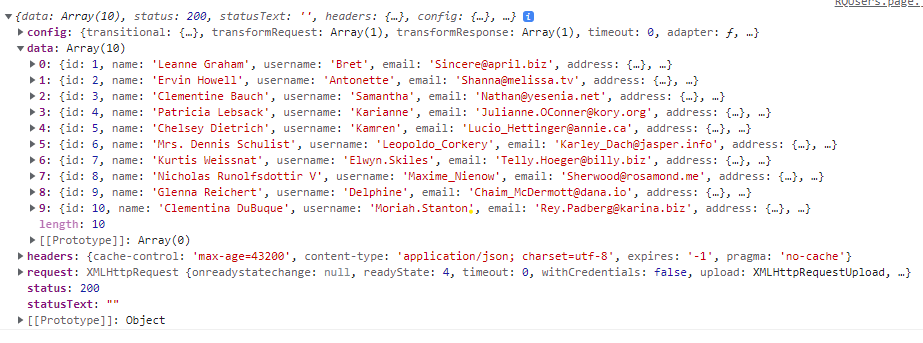
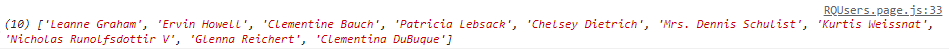
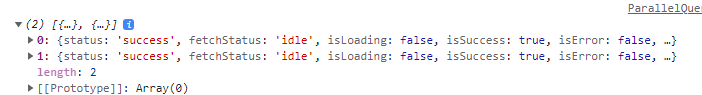

# React Query

# 1. React Query?

[**React Query**](https://react-query-v3.tanstack.com/)는 리액트 애플리케이션에서 서버 상태(**Server State**)를 가져오고, 캐싱, 동기화, 업데이트 작업을 쉽게 만들어주는 라이브러리이다.

---

공식 문서에서 기존 상태관리 라이브러리(redux, mobX..)는 비동기 또는 **Server State** 작업에는 그다지 좋지않다고 한다.

예를 들어 redux는 API 비동기 통신 라이브러리가 아니라 전역 상태 관리 라이브러리임에도 불구하고, 상태를 관리하는 코드보다 **redux-saga**, **redux-thunk**와 같은 코드가 훨씬 더 많이 차지하고 있다.

**React Query** 를 사용하면 **Server State**와 **Client State**를 분리하고 Store에서는 전역 상태를 저장하고 관리하는 역할만을 수행하도록 할 수 있다.

## Server State

공식 문서에서 **Server State**를 다음과 같이 설명하고 있다.

-   Client에서 제어하고나 소유하지 않는 위치에 원격으로 유지된다.
-   fetching, updating에 비동기 API가 필요하다.
-   공유 소유권(shared ownership)을 의미하고 사용자가 모르는 사이에 변경될 수 있다.
-   신경을 쓰지 않는다면 잠재적으로 **out of date** 가 될 가능성이 있다.

**React Query** 를 사용하면 아래와 같이 **Server State** 를 다룰 때 발생할 수 있는 문제들을 간단하게 해결할 수 있다.

1. 캐싱
2. 동일한 데이터에 중복 호출 제거
3. **out of date** 를 파악하고, 백그라운드에서 업데이트 가능
4. 가능한 한 빨리 데이터 업데이트를 반영
5. 페이지네이션, lazy loading 데이터의 성능 최적화
6. **Server State** 의 메모리 및 GC 관리

# React Query 설치 및 세팅

```
npm install react-query

yarn add react-query
```

먼저 `QueryClent` 인스턴스를 생성하고, 컴포넌트가 `QueryClient` 인스턴스에 접근할 수 있도록 루트가 되는 컴포넌트를 `QueryClentProvider`로 감싸준 후 `client` prop으로 `QueryClent`를 넘겨준다.

```
 import { QueryClient, QueryClientProvider } from 'react-query'

 const queryClient = new QueryClient()

 function App() {
   return <QueryClientProvider client={queryClient}>...</QueryClientProvider>
 }
```

# useQuery

데이터를 GET 하기 위한 `useQuery` api 이며, POST, UPDATE는 `useMutaion`을 사용한다.

## 예시

```
import { useQuery } from 'react-query'

const { data, isLoading } = useQuery(queryKey, queryFn, options);
```

`useQuery`의 반환값으로는

-   `data`, `isError`, `isLoading`, `refetch` .. 등 훨씬 많은 값들이 존재하지만
    대표적인 것들만 알아본다.

-   data : 응답한 데이터
-   isError : 서버 요청 실패에 대한 상태
-   isLoading : 캐시된 데이터가 없을 때 데이터를 요청 중인 상태
-   refetch : 해당 쿼리를 수동으로 refetch 하는 기능
-   isFetching : 캐시 상관없이 데이터를 요청 중인 상태

이미 반환값으로 `data`, `isLoading` 과 같은 값들이 존재하기 때문에

```
const [data, setData] = useState(null);
const [isLoading, setIsLoading] = useState(false);
```

과 같은 코드를 적지 않아도 되는 편리함이 존재한다.

[참고](https://react-query-v3.tanstack.com/reference/useQuery#_top)

## **1. queryKey**

-   `queryKey`을 기반으로 데이터 캐싱, refetching, 쿼리들을 공유할 수 있다.

    -   `queryKey`를 통해서 다른 곳에서도 해당 쿼리의 결과를 꺼내오는 것이 가능하다.

-   `queryKey`에는 문자열 또는 배열이 들어갈 수 있으며, 문자열을 전달하면 내부적으로 배열로 변환된다.

```
useQuery('todos', ...) // queryKey === ['todos']

useQuery(['todos'], ...)
```

_보통 컨벤션을 맞추기 위해서 배열로 통일_

**Update !! React Query v4 부터 모든 키는 배열로 선언해야함**

-   `querykey`는 항상 유니크해야 된다.
    -   객체의 키 순서는 상관이 없고, 배열 항목 순서가 중요하다.

```
// 동일한 key
useQuery(['todos', { status, page }], ...)
useQuery(['todos', { page, status }], ...)
useQuery(['todos', { page, status, other: undefined }], ...)

// 다른 key
useQuery(['todos', status, page], ...)
useQuery(['todos', page, status], ...)
useQuery(['todos', undefined, page, status], ...)
```

## **2. queryFn**

`useQuery`의 두 번째 인자로 `promise`를 반환하는 함수를 넣어준다.

```
import { useQuery } from 'react-query'

const fetchTodoList = () => {
    return axios.get("https://jsonplaceholder.typicode.com/users");
}

function App() {
    const result = useQuery('todos', fetchTodoList)
}
```

## **3. options**

`useQuery`의 세 번째 인자로 쿼리 옵션을 넣어준다.

### enabled: boolean

-   기본값 `true`, 마운트 시 자동으로 쿼리를 실행한다.
-   `false`로 설정하면 쿼리를 자동으로 실행하지 않는다.

```
const { data, isLoading, refetch } = useQuery('todos', fetchData, {
  enabled: false,
});
```

### staleTime: number | Infinity

-   `number`로 지정한 ms 만큼 시간이 경과하면 오래된 데이터(stale)로 간주하고, `refetch`한다(fresh).
-   즉, `fresh` -> `stale` 상태로 변경되는데 걸리는 시간을 뜻한다.
-   자주 변경되지 않는 데이터이면 `staleTime` 시간을 늘리는 것도 좋은 방법이다.
-   `fresh` 상태일 경우 unmount -> mount 되어도 fetch를 하지 않는다(네트워크 요청 X).
-   기본값 `0`

```
// staleTime을 5초로 설정
const { data, isLoading } = useQuery('todos', fetchData, {
  staleTime: 5000,
});
```

### cacheTime: number | Infinity

-   `unused/inactive` 한 캐시 데이터(**쿼리 인스턴스 unmount 시**)가 메모리에 남아있는 시간을 설정한다.
-   기본값 `5*60*1000`ms (5min)
-   `Infinity` 설정 시 GC 수집 비활성화
-   설정한 값만큼 시간이 지나지 않은 상태에서 해당 `queryKey`를 호출하면 이전에 가져왔던 데이터를 다시 보여준다.
-   만약 서버에서 값이 바뀌었다면, **캐시된 데이터를 먼저 보여주고 업데이트 된 데이터를 받아오면 업데이트 된 데이터를 보여준다**
    -   여기서 `isLoading` 값은 계속 `false` 이기 때문에 사용자는 Loading 화면을 보고 있지 않아도 된다.
-   설정한 시간이 경과하면 캐시된 데이터는 지워지고 서버에 다시 데이터를 요청한다.

```
// cacheTime 5초로 설정
const { data, isLoading } = useQuery('todos', fetchData, {
  cacheTime: 5000,
});
```

### refetchOnMount: boolean | "always" | ((query: Query) => boolean | "always")

-   기본값 `true`
-   `true` 로 설정하면 마운트 시 데이터가 `stale` 상태이면 `refetch` 한다.
-   `false` 로 설정하면 마운트 시 `refetch` 하지 않는다.
-   `always`로 설정하면 마운트 시 마다 매번 `refetch` 한다.

```
const { data, isLoading } = useQuery('todos', fetchData, {
  refetchOnMount: true,
});
```

### refetchOnWindowFocus: boolean | "always" | ((query: Query) => boolean | "always")

-   기본값 `ture`
-   `true` 로 설정하면 윈도우 포커싱 될 때 데이터가 `stale` 상태이면 `refetch` 한다.
-   `false` 로 설정하면 윈도우 포커싱 될 때에도 `refetch` 하지 않는다.
-   `always` 로 설정하면 윈도우 포커싱 될 때마다 `refetch` 한다.

```
const { data, isLoading } = useQuery('todos', fetchData, {
  refetchOnWindowFocus: true,
});
```

### refetchInterval: number | false | ((data: TData | undefined, query: Query) => number | false)

-   기본값 `0`
-   설정한 ms 빈도 만큼 `refetch` 한다.
-   polling
-   브라우저에 포커스가 없으면 실행하지 않는다.

```
const { data, isLoading } = useQuery('todos', fetchData, {
  refetchInterval: 3000,
});

```

### refetchIntervalInBackground: boolean

-   기본값 `false`
-   `true` 로 설정하면 브라우저에 포커스가 없어도 `refetchInterval`에서 설정한 ms 만큼 `refetch` 한다.

```
const { data, isLoading } = useQuery('todos', fetchData, {
  refetchInterval: 3000,
  refetchIntervalInBackground: true
});
```

### select: (data: TData) => unknown

-   쿼리 함수에서 반환된 데이터를 미리 가공해서 반환할 수 있다.

옵션을 사용하지 않았을 때

```
const { data, isLoading, isError, isFetching, error, refetch } = useQuery(
    ["users"],
    fetchData,
);

return (
    <>
        {data?.data.map((user) => {
        return <div key={user.id}>{user.id}</div>;
        })}
    </>
)
```

<p align="center">
    
</p>

`select` 옵션을 사용했을 때

```
const { data, isLoading, isError, isFetching, error, refetch } = useQuery(
    ["users"],
    fetchData,
    {
        select: (data) => {
                const userNames = data.data.map((user) => user.name);
                return userNames;
        },
    }
);

return (
    <>
      {data.map((userName) => {
            return <div key={userName}>{userName}</div>;
        })}
    </>
)
```

<p align="center">
    
</p>

원래 `data`의 `name` 값들만 가지고 올 수 있다.

더 많은 옵션을 보고싶으면 [공식 문서](https://react-query-v3.tanstack.com/reference/useQuery#_top)에 설명이 잘 되어있다.

# Query Key 활용

```
const fetchData = (userId) => {
    return axios.get(`https://jsonplaceholder.typicode.com/users/${userId}`);
};

export const useUser = (onSuccess, onError, userId) => {
    return useQuery(["user", userId], () => fetchData(userId));
};
```

```
const fetchData = ({ queryKey }) => {
    console.log(queryKey);
    // ['user', '7']

    const userId = queryKey[1];
    return axios.get(`https://jsonplaceholder.typicode.com/users/${userId}`);
};

export const useUser = (onSuccess, onError, userId) => {
    return useQuery(["user", userId], fetchData);
};
```

_위의 두 코드는 동일하다_

`queryKey` 의 `userId` 를 `queryFn` 의 파라미터로 전달할 수 있다.

# Parallel Queries

`useQuery`는 비동기로 실행이 되기 때문에, 한 컴포넌트에 여러 개의 `useQuery`를 사용하게 되면 병렬적으로 실행이 된다.

```
const user1 = useQuery(["fetch-user", 1], () => fetchUserById(1))
const user2 = useQuery(["fetch-user", 2], () => fetchUserById(2))

user1, user2 변수에 대한 로딩, 성공, 실패처리를 모두 해야한다.
```

또는 `useQueries`를 사용해서 위와 같은 기능을 하는 코드를 구현할 수 있다.

```
const results = useQueries({
    queries: [
        {
            queryKey: ["fetch-user", 1],
            queryFn: () => fetchUserById(1),
        },
        {
            queryKey: ["fetch-post", 2],
            queryFn: () => fetchPostById(2),
        },
    ],
});

console.log(results);
```

<p align="center">
    
</p>

`useQueries`는 동적으로 변화하는 상황에서 더 유용하게 쓰인다.

아래의 코드를 보자.

```
const users = [1, 2];

const results = useQueries({
    queries: users.map((id) => {
        return {
            queryKey: ["fetch-user", id],
            queryFn: () => fetchUserById(id),
        };
    }),
});
```

여기서 `users`의 값을 1, 2로 하드코딩을 했지만, 실제로는 값이 상황에 따라서 달라질 수 있다.

`useQueries`를 사용하면 이런 동적으로 변화하는 상황에서 더욱 깔끔하게 코드를 작성할 수 있다.

# Dependent Queries

위의 경우와 달리 `useQuery`를 동기적으로 실행해야 하는 경우가 생길 수 있다.

그럴 때는 `options`으로 `enabled` 속성을 사용하면 동기적으로 실행이 가능하다.

```
const { data: user } = useQuery(['user', email], getUserByEmail)

const userId = user?.id

const { isIdle, data: projects } = useQuery(
   ['projects', userId],
   getProjectsByUser,
   {
     // userId가 존재하면 enabled: true 가 된다.
     enabled: !!userId,
   }
)

// isIdle 은 enabled가 true로 바뀔 때까지 true 상태
```

# Mutaions

## useMutaion

data를 `create`, `update`, `delete` 하는 작업을 위해서 사용된다.

```
const mutationData = useMutation(mutationFn, options)
```

[useMutaion 반환값, options 확인](https://tanstack.com/query/v4/docs/reference/useMutation?from=reactQueryV3&original=https://react-query-v3.tanstack.com/reference/useMutation)

예시

```
function App() {
const mutation = useMutation(newTodo => {
     return axios.post('/todos', newTodo)
})

return (
    <div>
    {mutation.isLoading ? (
        'Adding todo...'
    ) : (
        <>
        {mutation.isError ? (
            <div>An error occurred: {mutation.error.message}</div>
        ) : null}

        {mutation.isSuccess ? <div>Todo added!</div> : null}

        <button
            onClick={() => {
            mutation.mutate({ id: new Date(), title: 'Do Laundry' })
            }}
        >
            Create Todo
        </button>
        </>
    )}
    </div>
)
}
```

`mutate`는 `useMutation`을 이용해 작성된 내용이 실행될 수 있도록 **trigger** 역할을 한다.

데이터를 `update`, `delete`, `create` 하고 싶을 때 `mutate`를 호출한다.

## Query Invalidation

`useMutaion`을 사용해서 데이터를 `update`, `delete`, `create`를 하고 나서 변경된 데이터를 확인하고 싶으면 데이터를 새로 `fetch` 해야한다.

이런 상황을 간단하게 해결할 수 있는 방법으로 `invalidateQueries`를 사용할 수 있다.

`useQuery`가 가지고 있던 `queryKey`의 유효성을 제거(무효화)해서 캐싱되어 있던 데이터를 보여주지 않고 데이터를 새로 받아올 수 있게 한다.

```
import { useMutation, useQueryClient } from 'react-query';
...

const queryClient = useQueryClient();

const mutation = useMutation(postTodo, {
  onSuccess: () => { // 요청이 성공한 경우
      // 캐시가 있는 모든 쿼리 무효화
    queryClient.invalidateQueries();

    // queryKey가 'todos'로 시작하는 모든 쿼리 무효화
    queryClient.invalidateQueries('todos');
  }
  ...
});
```

## setQueryData

`setQueryData`는 기존에 `queryKey`에 매핑되어 있던 데이터를 새롭게 정의할 떄 사용한다.

```
const queryClient = useQueryClient()

const mutation = useMutation(editTodo, {
   onSuccess: data => { // 요청이 성공한 경우
    // data가 fetchTodoById로 들어감
    queryClient.setQueryData(['todo', { id: 5 }], data)
   }
})

mutation.mutate({
   id: 5,
   name: 'Do the laundry',
})

const { status, data, error } = useQuery(['todo', { id: 5 }], fetchTodoById)
```

# 참고

[React Query 공식문서](https://react-query-v3.tanstack.com/)
[Youtube - Codevolution](https://www.youtube.com/c/Codevolution)
[TanStack](https://tanstack.com/query/v4/docs/adapters/react-query)
